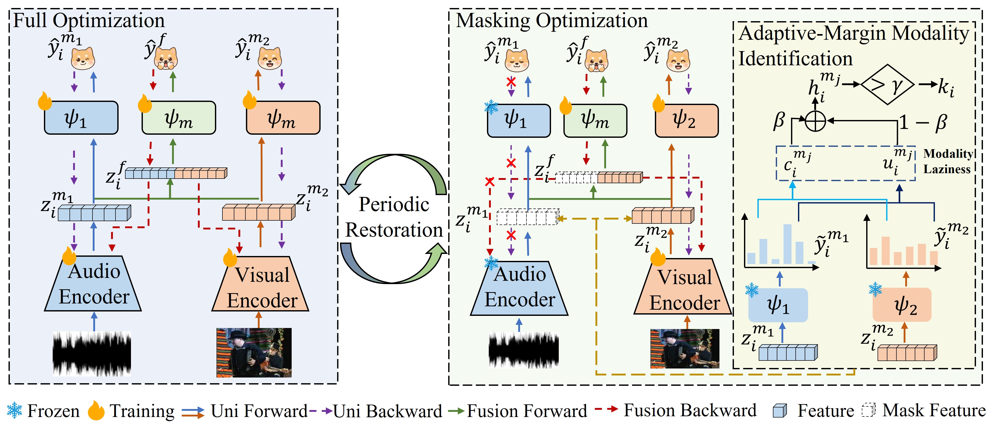

# AMRe

This is the code repository of AMRe, and the model diagram is as follows:



You can simply use bash commands to start this job

```
bash scripts/CREMAD/cremed_base.sh
```

All results are saved in the **results-AMRe-concat.log** file, with relevant runtime logs stored in the **log** directory.
